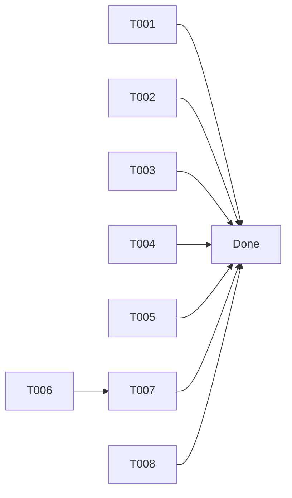

# Tasks: PR #151 Review Comments

**Input**: PR review comments from `pr_review_comments_readable.txt`, Analysis from `pr-review-plan.md`
**Prerequisites**: Original M3.5 implementation complete, PR open on branch `010-m35-cleanup`

**Tests**: Not required - these are comment/naming improvements with no functional changes (except error message enhancement which has existing test coverage).

## Format: `[ID] [P?] Description`

- **[P]**: Can run in parallel (different files, no dependencies)
- All tasks are independent polish items from a single PR review

---

## Phase 1: Comment Clarifications

**Purpose**: Improve code documentation accuracy as requested by reviewers

**Goal**: Comments accurately reflect code behavior, reducing confusion for future maintainers

- [ ] T001 [P] Update comment in internal/cmd/validate.go:284 to clarify errors exclude warnings
- [ ] T002 [P] Update comment in internal/config/loader/loader_test.go:337 to clarify strict mode context
- [ ] T003 [P] Expand comment in integration/validate_test.go:68-70 to explain why test expects errors without --strict
- [ ] T004 [P] Add comment in internal/config/loader/loader.go:120 documenting variadic opts "first wins" behavior

**Checkpoint**: All reviewer-requested comment clarifications complete

---

## Phase 2: Naming Consistency

**Purpose**: Align local variable names with field names for consistency

**Goal**: Variable naming matches the generic `UseCompose` field name

- [ ] T005 Rename local variables in internal/app/planner/planner.go:
  - Line 68: `useComposeStop` → `useComposeForStop`
  - Line 88: `useComposeStart` → `useComposeForStart`

**Checkpoint**: Variable naming is consistent and explicit

---

## Phase 3: Error Message Enhancement

**Purpose**: Improve UX by providing actionable context in strict mode errors

**Goal**: Strict mode errors clearly indicate why they're errors (not just warnings)

- [ ] T006 Update `AddUnknownKey()` message in internal/config/loader/errors.go:94 to include "(rejected in strict mode)"
- [ ] T007 Update test assertion in internal/config/loader/errors_test.go if message format changed

**Checkpoint**: Error messages provide clear context for strict mode rejections

---

## Phase 4: Review Response

**Purpose**: Acknowledge intentionally deferred items

**Goal**: PR reviewer understands which items are addressed vs intentionally deferred

- [ ] T008 Reply to Dockerfile TODO comment on PR explaining intentional deferral to documentation milestone

**Checkpoint**: All review comments addressed or acknowledged

---

## Dependencies



**Parallel Execution**: T001, T002, T003, T004 can all run in parallel. T005 is independent. T006→T007 are sequential. T008 is independent (GitHub action).

---

## Implementation Notes

### T001: validate.go comment
```go
// Before:
// Print config label errors (entity-grouped)

// After:
// Print config label errors (entity-grouped, excluding warnings)
```

### T002: loader_test.go comment
```go
// Before:
// Should have at least 3 errors (unknown key + 2 parse errors)

// After:
// Should have 3 errors: 1 unknown key (strict mode) + 2 parse errors
```

### T003: validate_test.go comment
```go
// Before:
// Run bosun config validate with --strict to treat unknown keys as errors
// (Without --strict, unknown keys are only warnings per #139)

// After:
// Run bosun config validate with --strict to treat unknown keys as errors.
// Without --strict, unknown keys are only warnings per #139, but this test
// still expects errors due to other validation failures (invalid duration, etc.).
```

### T004: loader.go comment
```go
// Before:
// Merge options (default is lenient mode)
var opt LoadOptions
if len(opts) > 0 {
    opt = opts[0]
}

// After:
// Merge options (default is lenient mode).
// Note: If multiple LoadOptions are passed, only the first is used.
var opt LoadOptions
if len(opts) > 0 {
    opt = opts[0]
}
```

### T005: planner.go variable rename
```go
// Before:
useComposeStop := false
useComposeStart := false

// After:
useComposeForStop := false
useComposeForStart := false
```

### T006: errors.go message
```go
// Before:
Message: fmt.Sprintf("unknown key: %s", key),

// After:
Message: fmt.Sprintf("unknown key: %s (rejected in strict mode)", key),
```

---

## Verification

```bash
# After all tasks complete:
make lint      # No new lint warnings
make test      # All tests pass
make build     # Binary builds successfully

# Push and mark review comments as resolved
git push origin 010-m35-cleanup
```

---

## Summary

| Phase | Tasks | Parallel? | Estimated Time |
|-------|-------|-----------|----------------|
| 1. Comment Clarifications | T001-T004 | Yes | 5 min |
| 2. Naming Consistency | T005 | N/A | 5 min |
| 3. Error Message | T006-T007 | Sequential | 10 min |
| 4. Review Response | T008 | N/A | 5 min |
| **Total** | **8 tasks** | | **~25 min** |
